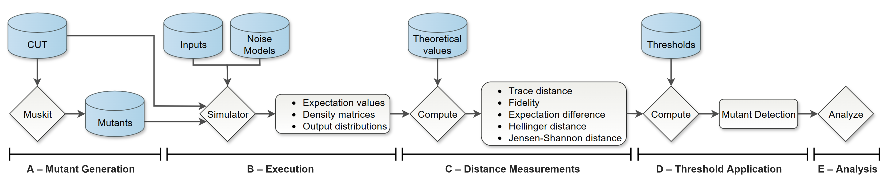

# Empirical Evaluation On Noise-Aware Quantum Mutant Detection

This repository contains the full workflow for our empirical evaluation, including mutant generation, execution, distance computation, thresholding, and analysis.

An overview of the workflow is presented in the experiment flow diagram below.

## Workflow Overview

### A. Mutant Generation and Selection

- `selectMutants.ipynb` — Script used to select a representative subset of mutants previously generated using [Muskit](https://github.com/EnautMendi/Muskit.git).

### B. Execution
- `fileExecution_runs.py`, `checkNoise.py` — Script for execution of all Origin QCs and mutants across input configurations and noise models.
This step generates the main execution data, which cannot be stored in the repository due to size constraints; the data is available in the [cloud](https://drive.google.com/drive/folders/1G2uzHpJNSe9Li7X_VYoimoFpPME1YPDD?usp=sharing).

### C. Distance Measurements
- `distances.py`, `checkNoise.py` — Computation of distance metrics under noise from all execution traces and export to CSV.

### D. Threshold Application
- `compute_ideal_noisy_thresholds.py`, `compute_middle_above_thresholds.py`, `checkMutation.py`  —  Computation of thresholds and application to the computed distances to determine mutant detection outcomes.

### E. Analysis
- `analize_results_mutation.ipynb`, `analize_results_noise.ipynb`, `statistics.ipynb`, `visu_RQ0.ipynb`, `visu_RQ1.ipynb`, `visu_RQ2.ipynb` — Aggregation of detection results and analysis addressing the research questions.

## Other Relevant Scripts
- `commons.py` — Functionalities and definitions to be used in several steps.
- `pure_states_generator.py` — Generation of input states to be used as initialisations.
- `noisemodel.py` — Generation of noise models based on the characteristics provided.

## Data Structure
- `data/` — Origin QC used to generate mutants from and inputs used when executing.
- `results/` — All processed results used to answer each of the RQ.
- `results_noise_analysis/` — Results of the executions under noise.
- `results_original_30_runs/` — Execution outputs of the origin QC used when calculating thresholds.
- `noise_models_24_01_2025_1630/` — Configurations of the IBM noise models used.
- [All mutants selected](https://drive.google.com/drive/folders/1ZHPigphmU8ssA0TC0J_vqYhi3n4Y0sLN?usp=sharing)
- [Raw execution results all muatnts](https://drive.google.com/drive/folders/1G2uzHpJNSe9Li7X_VYoimoFpPME1YPDD?usp=sharing)

## Requirements
- Required packages listed in `requirements.txt`

## Citation
If you use this workflow or dataset, please cite our work.
